# Harari Prosperity App 📱

**Empowering Political Analysis and Community Development Through Technology**

A comprehensive Flutter mobile application designed for the Harari Regional Prosperity Party in Ethiopia. This app serves as a digital platform for political analysis reporting, enabling party members and officials to submit detailed reports with supporting documentation to party leadership.

---

## 📋 Table of Contents

- [🎯 Overview](#-overview)
- [🛠 Technical Stack](#-technical-stack)
- [🚀 Quick Start](#-quick-start)
- [📁 Project Structure](#-project-structure)
- [🔐 Authentication Flow](#-authentication-flow)
- [📋 Report Creation Process](#-report-creation-process)
- [🌍 Multi-Language Support](#-multi-language-support)
- [🔧 Development Guidelines](#-development-guidelines)
- [🚀 Deployment](#-deployment)
- [🔒 Security Features](#-security-features)
- [📊 Database Schema](#-database-schema)
- [🧪 Testing](#-testing)
- [🚨 Troubleshooting](#-troubleshooting)
- [🤝 Contributing](#-contributing)
- [📞 Support & Contact](#-support--contact)
- [📈 Version History](#-version-history)

---

## 🎯 Overview

Welcome to the **Harari Prosperity App** - where political engagement meets modern technology. This application represents a significant step forward in how the Harari Regional Prosperity Party conducts political analysis and reporting.

### 🤝 What We Do

The **Harari Prosperity App** is a specialized mobile application that digitizes the political analysis and reporting process for the Harari Regional Prosperity Party. It provides a structured, user-friendly interface for creating comprehensive reports that include political analysis, stakeholder mapping, trend analysis, and future planning recommendations.

Think of it as your digital political notebook - a tool that transforms how you document observations, analyze trends, and propose actionable recommendations that can shape your region's future.

### 👥 Who We Serve

We're proud to support the following key stakeholders in Ethiopia's vibrant Harari region:

- **🏛️ Party Officials and Members**: Active participants in regional politics who need to report observations and insights
- **🔍 Political Analysts and Researchers**: Experts who conduct in-depth analysis of political trends and stakeholder dynamics
- **🎯 Regional Coordinators**: Leaders who coordinate activities and need comprehensive reporting tools
- **📋 Policy Advisors**: Professionals who provide recommendations for future planning and strategic decisions

### ✨ Key Capabilities

Here are the core features that make our platform powerful yet easy to use:

- **📋 Structured Reporting**: A guided 5-step wizard that ensures comprehensive, consistent report creation
- **📎 Document Management**: Attach files, images, and links to provide evidence and context for your analysis
- **🌍 Multi-language Support**: Full support for English, Amharic (አማርኛ), and Oromo (Afaan Oromoo) languages
- **🔐 Secure Authentication**: Robust user management with JWT tokens and email verification
- **💾 Auto-save**: Draft reports are automatically saved as you work - never lose your progress
- **📊 Progress Tracking**: Save drafts as you work and track report approval status
- **🤝 Collaborative Platform**: Connect individual insights into a collective understanding of regional dynamics

---

*Ready to get started? Let's walk through the technical foundation and setup process.*

## 🛠 Technical Stack

*Building on proven technologies to ensure reliability, performance, and maintainability.*

### Frontend (Mobile App)
- **Flutter 3.8.1+** - Google's cross-platform mobile development framework for beautiful, native-like applications
- **Dart** - Flutter's programming language, designed for building fast, scalable applications
- **Material Design** - Google's comprehensive design system for consistent, intuitive user interfaces

### Backend & Database
- **Node.js/Express** - Robust JavaScript runtime and web framework for scalable server-side applications
- **MongoDB** - Flexible NoSQL database with Mongoose ODM for efficient data modeling and querying
- **JWT Authentication** - Industry-standard JSON Web Tokens for secure, stateless authentication

### State Management & Storage
- **Provider** - Flutter's recommended state management solution for reactive, maintainable app state
- **SharedPreferences** - Secure local key-value storage for user preferences and app settings

### Key Dependencies

Here's what powers our application under the hood:

```yaml
# Core Flutter packages
flutter_localizations: sdk: flutter    # Multi-language support
provider: ^6.1.1                       # State management
shared_preferences: ^2.2.2             # Local storage

# File & Network handling
file_picker: ^8.0.0+1                  # File selection and upload
http: ^1.2.1                          # Network requests and API communication
url_launcher: ^6.2.5                  # External link handling

# Document processing
printing: ^5.12.0                     # Document printing capabilities
pdf: ^3.10.7                          # PDF generation and handling

# Utilities
path_provider: ^2.1.3                 # File system access
share_plus: ^9.0.0                    # Content sharing functionality
```

*Each dependency is carefully chosen for its reliability, community support, and alignment with Flutter best practices.*

## 🚀 Quick Start

This guide will help you set up the complete development environment on a new PC. Follow these steps in order.

### 📋 Prerequisites

Before starting, ensure you have the following installed:

| Tool | Version | Installation Guide |
|------|---------|-------------------|
| **Flutter SDK** | 3.8.1+ | [Install Flutter](https://docs.flutter.dev/get-started/install) |
| **Android Studio** | Latest | [Download Android Studio](https://developer.android.com/studio) |
| **Node.js** | 18+ | [Download Node.js](https://nodejs.org/) |
| **MongoDB** | 4.4+ | [Install MongoDB](https://docs.mongodb.com/manual/installation/) |
| **Git** | Any recent | [Install Git](https://git-scm.com/downloads) |

### 1. Environment Setup

#### Step 1.1: Install Flutter SDK
```bash
# Download Flutter SDK
git clone https://github.com/flutter/flutter.git -b stable
cd flutter

# Add Flutter to PATH (add this to your ~/.bashrc or ~/.zshrc)
export PATH="$PATH:`pwd`/bin"

# Reload your shell or restart terminal
source ~/.bashrc  # or source ~/.zshrc

# Verify Flutter installation
flutter doctor
```

**Expected output:**
```
Doctor summary (to see all details, run flutter doctor -v):
[✓] Flutter (Channel stable, 3.8.1, on Linux, locale en_US.UTF-8)
[✓] Android toolchain - develop for Android devices (Android SDK version 33.0.0)
[!] Android Studio (not installed)
[✓] VS Code (version 1.74.0)
...
```

#### Step 1.2: Install Android Studio (for Android development)
```bash
# Download and install Android Studio from: https://developer.android.com/studio
# Follow the setup wizard and install Android SDK

# Set up Android environment variables
export ANDROID_HOME=$HOME/Android/Sdk
export PATH=$PATH:$ANDROID_HOME/emulator
export PATH=$PATH:$ANDROID_HOME/platform-tools

# Accept Android licenses
flutter doctor --android-licenses
```

#### Step 1.3: Install Node.js and MongoDB
```bash
# Install Node.js (Ubuntu/Debian)
curl -fsSL https://deb.nodesource.com/setup_18.x | sudo -E bash -
sudo apt-get install -y nodejs

# Install MongoDB (Ubuntu/Debian)
wget -qO - https://www.mongodb.org/static/pgp/server-4.4.asc | sudo apt-key add -
echo "deb [ arch=amd64,arm64 ] https://repo.mongodb.org/apt/ubuntu focal/mongodb-org/4.4 multiverse" | sudo tee /etc/apt/sources.list.d/mongodb-org-4.4.list
sudo apt-get update
sudo apt-get install -y mongodb-org

# Start MongoDB service
sudo systemctl start mongod
sudo systemctl enable mongod

# Verify installations
node --version
npm --version
mongosh --version
```

### 2. Project Setup

#### Step 2.1: Clone the Repository
```bash
# Clone the project
git clone https://github.com/your-repo/harari_prosperity_app.git
cd harari_prosperity_app

# Verify project structure
ls -la
```

#### Step 2.2: Backend Setup
```bash
# Navigate to backend directory
cd backend

# Install Node.js dependencies
npm install

# Copy environment configuration
cp .env.example .env

# Edit .env file with your MongoDB connection string
nano .env  # or use your preferred editor
```

**Required .env configuration:**
```env
MONGODB_URI=mongodb://localhost:27017/harari_prosperity_app
JWT_SECRET=your-super-secret-jwt-key-here
PORT=3000
NODE_ENV=development
```

```bash
# Start the backend server
npm run dev

# You should see: "Server running on port 3000"
# Keep this terminal running
```

**Verify backend is running:**
```bash
# Open a new terminal and test the API
curl http://localhost:3000/health
# Expected: {"status": "OK", "message": "Server is running"}
```

#### Step 2.3: Mobile App Setup
```bash
# Go back to project root
cd ..

# Install Flutter dependencies
flutter pub get

# Verify Flutter setup
flutter doctor

# Connect Android device or start emulator
flutter devices

# Run the app
flutter run

# The app should launch on your device/emulator
```

### 3. Verification Steps

#### Step 3.1: Verify Complete Setup
```bash
# Check if all services are running

# 1. MongoDB should be running
sudo systemctl status mongod

# 2. Backend server should be accessible
curl http://localhost:3000

# 3. Flutter app should be running
# You should see the Harari Prosperity App on your device/emulator
```

#### Step 3.2: Test Core Functionality
1. **App Launch**: App should open to splash screen
2. **Authentication**: Try creating a new account or logging in
3. **Report Creation**: Navigate through the 5-step report wizard
4. **File Attachments**: Test uploading a file in the attachment screen

### 4. Development Workflow

#### Running in Development Mode
```bash
# Terminal 1: Backend server (with auto-reload)
cd backend && npm run dev

# Terminal 2: Flutter app (with hot-reload)
flutter run
```

#### Building for Production
```bash
# Backend production build
cd backend && npm run start

# Flutter production builds
flutter build apk --release          # Android APK
flutter build appbundle --release    # Google Play bundle
flutter build ios --release          # iOS (macOS only)
```

### 5. Common Issues & Solutions

#### Issue: Flutter Doctor Shows Errors
```bash
# Fix Android setup
flutter doctor --android-licenses

# Update Android SDK
flutter doctor -v  # See detailed errors
sdkmanager --update

# Clear Flutter cache
flutter clean
flutter pub get
```

#### Issue: MongoDB Connection Failed
```bash
# Check MongoDB status
sudo systemctl status mongod

# Start MongoDB if stopped
sudo systemctl start mongod

# Check MongoDB logs
tail -f /var/log/mongodb/mongod.log

# Reset MongoDB data (if needed)
sudo systemctl stop mongod
sudo rm -rf /var/lib/mongodb/*
sudo systemctl start mongod
```

#### Issue: Backend Won't Start
```bash
# Check Node.js version
node --version  # Should be 18+

# Clear npm cache
npm cache clean --force

# Reinstall dependencies
rm -rf node_modules package-lock.json
npm install

# Check for port conflicts
lsof -i :3000  # See what's using port 3000
```

#### Issue: App Won't Build
```bash
# Clean Flutter cache
flutter clean
flutter pub get

# Update dependencies
flutter pub upgrade

# Check for platform-specific issues
flutter doctor -v
```

### 6. First Run Checklist

- [ ] Flutter SDK installed and configured
- [ ] Android Studio installed (for Android development)
- [ ] Node.js 18+ installed
- [ ] MongoDB installed and running
- [ ] Project cloned and dependencies installed
- [ ] Backend server running on localhost:3000
- [ ] Flutter app launches successfully
- [ ] Can navigate through authentication flow
- [ ] Can access report creation wizard

### 7. Getting Help

If you encounter issues:

1. **Check the troubleshooting section above**
2. **Run `flutter doctor -v`** for detailed diagnostics
3. **Check terminal output** for specific error messages
4. **Verify all services are running** using the verification commands
5. **Contact the development team** if issues persist

**Next Steps**: Once everything is set up, read the [Development Guidelines](#-development-guidelines) section to understand the codebase structure and start contributing!

## 📁 Project Structure

*Understanding how our codebase is organized helps you navigate and contribute effectively.*

```
harari_prosperity_app/
├── 📱 lib/                          # 🏠 Main Flutter application code
│   ├── 🎯 features/                 # 🔧 Feature-based modules (organized by functionality)
│   │   ├── 🔐 authentication/       # User login, signup, password reset
│   │   ├── 🏠 home/                 # Welcome screen and main dashboard
│   │   ├── 📊 report/               # Report creation wizard and management
│   │   ├── ⚙️ settings/             # App settings and user preferences
│   │   └── ❓ faq/                  # Help system and FAQ
│   ├── 🛣️ routes/                   # 🧭 App navigation and routing configuration
│   ├── 🤝 shared/                   # 🔗 Shared utilities and components
│   │   ├── ⚙️ config/               # ⚙️ Configuration files and API settings
│   │   ├── 🎨 constants.dart        # 🎨 App colors, themes, and constants
│   │   ├── 🌐 localization/         # 🌍 Multi-language support and translations
│   │   ├── 📋 models/               # 📊 Data models (Report, User, etc.)
│   │   ├── 🔧 services/             # 🔗 Business logic and API services
│   │   └── 🧩 widgets/              # 🧱 Reusable UI components
│   └── 🚀 main.dart                 # 🚀 Application entry point
├── 🔧 backend/                      # 🖥️ Node.js/Express backend API
│   ├── 📄 server.js                # 🌐 Main server file and application setup
│   ├── 🛣️ routes/                   # 🛤️ API route handlers (auth, reports, users)
│   ├── 📋 models/                   # 💾 Database models and schemas
│   ├── 🔧 middleware/               # 🛡️ Express middleware (auth, validation)
│   └── 🛠️ utils/                    # 🧰 Utility functions (email, JWT, etc.)
├── 📱 android/ & 📱 ios/            # 📱 Platform-specific configuration
├── 🎨 assets/                       # 🎨 Static assets (images, fonts, icons)
└── 📋 README.md                     # 📖 Project documentation (this file)
```

### 🏗️ Architecture Philosophy

Our project structure follows the **feature-first architecture** principle:

- **🎯 Features over Layers**: Code is organized by functionality (authentication, reports) rather than technical layers (UI, services, models)
- **🔗 Shared Resources**: Common utilities, services, and components are centralized for reusability
- **🧩 Modular Design**: Each feature is self-contained but can easily integrate with others
- **📱 Platform Separation**: Clear separation between Flutter frontend and Node.js backend

*This structure makes it easy to find relevant code, understand feature boundaries, and maintain consistency across the application.*

---

## 🔐 Authentication Flow

*Understanding how users securely access our platform is fundamental to the app's security model.*

```mermaid
graph TD
    A[🚀 App Launch] --> B{🔍 Session Exists?}
    B -->|✅ Yes| C[🔐 Validate JWT Token]
    B -->|❌ No| D[📱 Show Login/Signup]
    C -->|✅ Valid| E[🏠 Navigate to Home]
    C -->|❌ Invalid| D
    D --> F[👤 User Login]
    F --> G[📧 Email Verification]
    G --> H[✅ Access Granted]
```



*Our authentication system ensures that only verified party members can access the platform while maintaining a smooth user experience.*

---

## 📋 Report Creation Process

*At the heart of our application is a comprehensive 5-step wizard that guides users through creating detailed political analysis reports.*

The app features a comprehensive 5-step report creation wizard that ensures systematic, thorough political analysis:

### Step 1: 📋 Basic Information
- Report title and type selection
- Receiver name and contact details
- Report objective and brief description
- Category classification

### Step 2: ⭐ Importance & Main Points
- Strategic importance explanation
- Key findings and main points
- Information sources documentation
- Supporting evidence

### Step 3: 👥 Stakeholder Analysis
- Roles and responsibilities of actors
- Positive and negative trend analysis
- Key themes identification
- Stakeholder mapping

### Step 4: 🔮 Implications & Scenarios
- Potential outcomes and implications
- Scenario planning and analysis
- Risk assessment
- Future projections

### Step 5: 🚀 Future Plans & Metadata
- Proposed action plans
- Timeline and milestones
- Approving authority details
- Sender information and role

*Each step builds upon the previous one, ensuring comprehensive analysis while maintaining user engagement throughout the process.*

---

## 🌍 Multi-Language Support

*Language accessibility is crucial for serving Ethiopia's diverse linguistic landscape.*

The app supports three languages with comprehensive localization:

- **🇺🇸 English** - Default language
- **🇪🇹 Amharic (አማርኛ)** - Official Ethiopian language
- **🇪🇹 Oromo (Afaan Oromoo)** - Regional language

### Language Implementation
- **Real-time language switching** without app restart
- **RTL (Right-to-Left) support** where needed for proper text direction
- **200+ translated strings** covering all UI elements, error messages, and help content
- **Culturally appropriate translations** for political context and local sensitivity

*This ensures that party members can use the app in their preferred language, making political analysis accessible to all stakeholders regardless of their linguistic background.*

## 🔧 Development Guidelines

### Code Organization
- **Feature-First Architecture**: Organized by features rather than technical layers
- **Separation of Concerns**: Clear separation between UI, business logic, and data layers
- **Provider Pattern**: Reactive state management across the app

### Code Quality Standards
```bash
# Format code
flutter format .

# Analyze for issues
flutter analyze

# Run tests
flutter test

# Check code coverage
flutter test --coverage
```

### Commit Convention
```
feat: add new feature
fix: bug fix
docs: documentation update
style: code style changes
refactor: code refactoring
test: add tests
chore: maintenance tasks
```

## 🚀 Deployment

### Development Build
```bash
# Run in debug mode
flutter run

# Enable hot reload for development
flutter run --debug
```

### Production Build
```bash
# Build APK for Android
flutter build apk --release

# Build IPA for iOS (macOS only)
flutter build ios --release

# Build App Bundle for Google Play
flutter build appbundle --release
```

### Backend Deployment
```bash
# Production build
npm run start

# With PM2 for process management
pm2 start server.js --name "harari-backend"
```

## 🔒 Security Features

- **JWT Authentication**: Secure token-based authentication
- **Email Verification**: Required email confirmation for new accounts
- **Password Encryption**: bcryptjs for secure password hashing
- **Row Level Security**: Users can only access their own reports
- **File Upload Security**: Secure file handling with validation

## 📊 Database Schema

### Report Model
```javascript
{
  id: ObjectId,
  user_id: ObjectId,           // Report owner
  name: String,                // Report title
  reportType: String,          // Report category
  receiverName: String,        // Intended recipient
  objective: String,           // Report purpose
  description: String,         // Brief overview
  importance: String,          // Strategic significance
  mainPoints: String,          // Key findings
  sources: String,             // Information sources
  roles: String,               // Stakeholder roles
  trends: String,              // Trend analysis
  themes: String,              // Key themes
  implications: String,        // Potential outcomes
  scenarios: String,           // Future scenarios
  futurePlans: String,         // Proposed actions
  approvingBody: String,       // Authority details
  senderName: String,          // Author name
  role: String,                // Author position
  date: String,                // Report date
  attachments: [String],       // File URLs
  linkAttachment: String,      // Optional URL
  status: String,              // 'draft' or 'completed'
  createdAt: DateTime,
  updatedAt: DateTime
}
```

## 🧪 Testing

### Running Tests
```bash
# Run all tests
flutter test

# Run specific test file
flutter test test/widget_test.dart

# Run with coverage
flutter test --coverage

# Generate coverage report
genhtml coverage/lcov.info -o coverage/html
```

### Test Structure
- **Unit Tests**: Test individual functions and services
- **Widget Tests**: Test UI components in isolation
- **Integration Tests**: Test complete user workflows

## 🚨 Troubleshooting

### Common Issues

**1. Flutter Doctor Issues**
```bash
# Clear Flutter cache
flutter doctor --android-licenses
flutter clean
flutter pub get
```

**2. Backend Connection Issues**
```bash
# Check if MongoDB is running
mongosh

# Verify backend server
curl http://localhost:3000/health

# Check environment variables
cd backend && cat .env
```

**3. Build Issues**
```bash
# Clean build files
flutter clean
flutter pub get

# Update dependencies
flutter pub upgrade

# Check for platform-specific issues
flutter doctor -v
```

## 🤝 Contributing

### Development Workflow
1. **Fork** the repository
2. **Create** a feature branch (`git checkout -b feature/amazing-feature`)
3. **Make** your changes following the code standards
4. **Add tests** for new functionality
5. **Commit** your changes (`git commit -m 'feat: add amazing feature'`)
6. **Push** to the branch (`git push origin feature/amazing-feature`)
7. **Open** a Pull Request

### Code Review Process
- All submissions require review
- Tests must pass before merging
- Follow Dart/Flutter best practices
- Maintain consistent code style

## 📞 Support & Contact

### Getting Help
- **📖 Documentation**: This README and in-app help
- **🐛 Bug Reports**: [GitHub Issues](https://github.com/your-repo/issues)
- **💬 Feature Requests**: [GitHub Discussions](https://github.com/your-repo/discussions)

### Contact Information
- **Technical Support**: support@harariprosperity.et
- **Development Team**: dev@harariprosperity.et
- **Party Communications**: info@harariprosperity.et

## 📈 Version History

### v1.1.0 - Stability & Localization Updates (September 30, 2025)
- ✅ **Fixed**: Report creation errors with MongoDB ObjectId handling
- 🌍 **Enhanced**: Multi-language support with complete translation coverage
- 🔧 **Improved**: Data processing and error resilience
- ✅ **Tested**: Comprehensive testing for all major features

### v1.0.0 - Initial Release (August 15, 2025)
- 🚀 **Launched**: Complete mobile app with 5-step report wizard
- 🔐 **Implemented**: Secure authentication and user management
- 📎 **Added**: File attachment and document management
- 🌍 **Supported**: Multi-language interface (English, Amharic, Oromo)

---

**Built with ❤️ for the Harari Regional Prosperity Party**

*Empowering political analysis and community development through technology*

[](https://flutter.dev)
[](https://nodejs.org)
[](https://mongodb.com)
